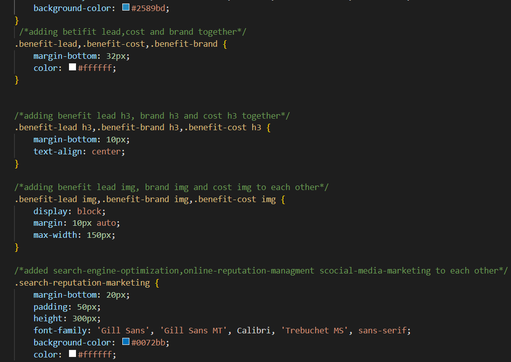

# git-init-sample
# challenge 01

## Description

- my motivation for this was to make the code easy to read, easy to acsess and to make it easer for the next person to wrok on it
- i built this project to show how i can shorten repation and to make it easy to read the code and to show how important notes are 
- One of the problem i solved was one of the id had something wrong in so i replaced it with the right thing also there was alot of repation 
so i gathered them in style and merged them together
- i learned how to work and make notes along the way and also learned whitch semantics to us together to replace div

## Usage

in this photo it shows how you can merged all the codes together because it was just a repation. so i will be usung this skill to clean up and to make the codes easer to read 

